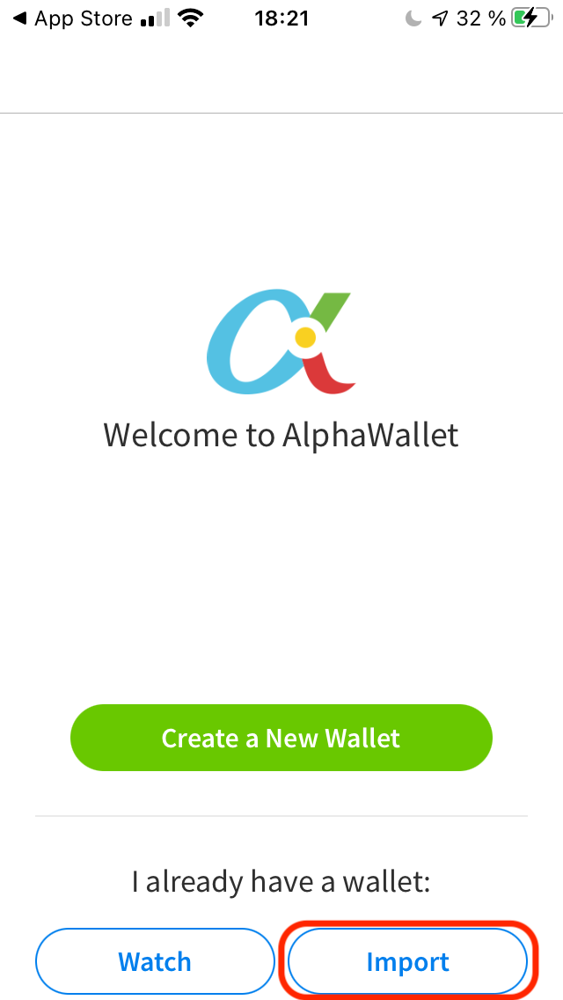
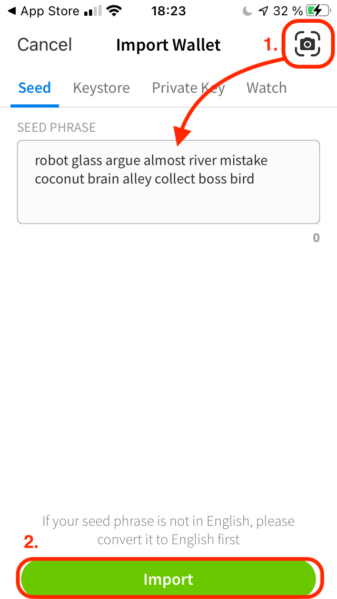
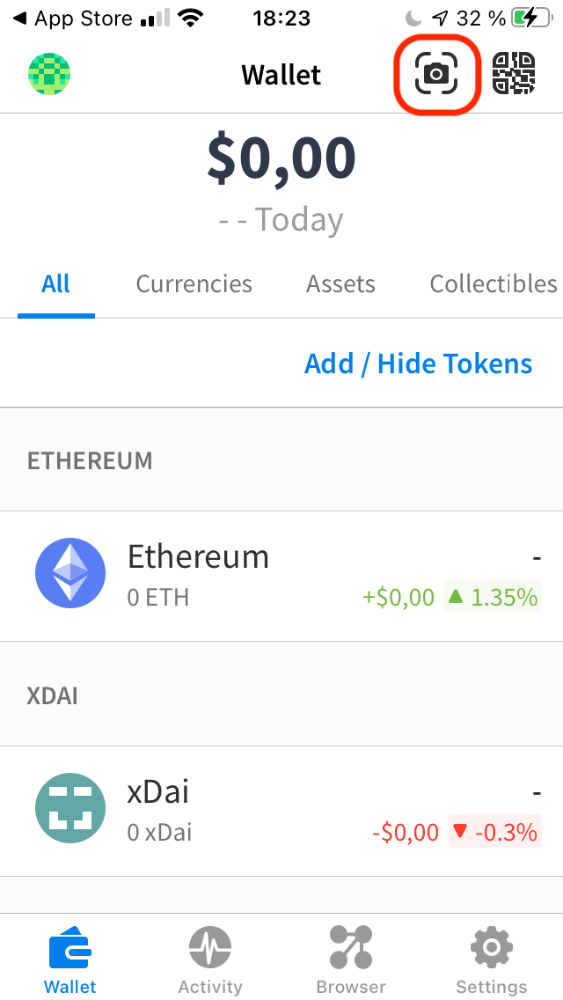
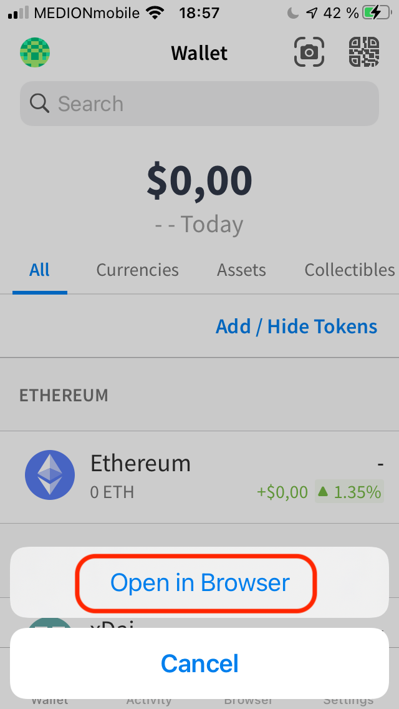
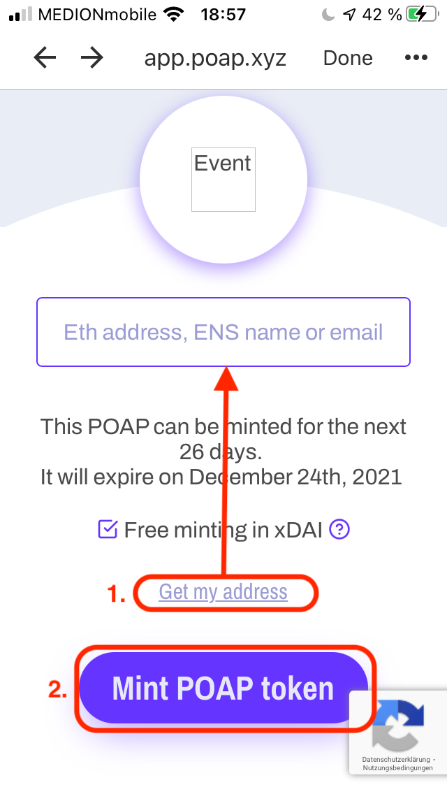
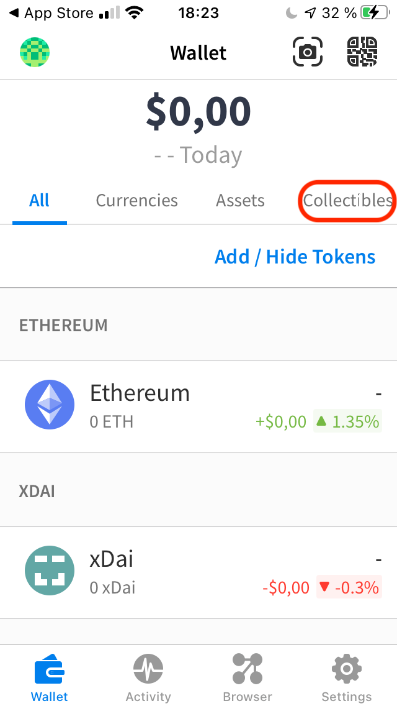

## ⛓ Was ist Ethereum?
[Ethereum](https://ethereum.org/en/) ist das größte Blockchain Netzwerk der Welt und es kann Programme jeglicher Art ausgeführen. Im Grunde ist eine Blockchain nichts anderes als eine dezentrale Datenbank, die verteilt gespeichert ist. 
Niemand kann die Datenbankeintrag unrechtmäßig manipulieren, denn das würden alle Teilnehmer im Netzwerk bemerken und verhindern.
Im Q1 2022 wird Ethereum seinen Energieverbrauch auf [weniger als 0.05% des jetzigen Verbrauchs reduzieren](https://decrypt.co/71353/ethereum-foundation-eth-2-0-will-use-99-95-less-energy) und ist damit umweltfreundlich.

## 🤷 Was kann man damit machen?
Damit kannst du z.B.
- Geld direkt an andere Teilnehmer verschicken ohne das eine Bank benötigt wird oder das verhindern könnte,
- digitale Wahlen durchführen ohne das die Stimmauszählung manipuliert werden kann,
-  Soziale Netzwerke aufbauen, die wirklich sozial sind und deine Daten schützen,
-  die Verwaltung digitalisieren (Besitzurkunden, Zeugnisse, signierte Dokumente) und damit Bürokratie für immer beenden,
-  deine persönlichen Daten selber verschlüsselt verwalten und gezielt freigegeben

und vieles mehr. Blockchain wird die Welt so stark verändern, wie es das Internet damals getan hat und uns hoffentlich die Macht über unsere Daten zurückgeben. ✊

Um daran teilzunehmen brauchst du nur eine Sache:

# 👛 Dein eigenes Ethereum Wallet
Ein Wallet ist ein Account in einem Blockchain Netzwerk, z.B. der Ethereum Hauptkette oder einer Ethereum kompatiblen Seitenkette. 
Auf der Rückseite der Karte findest du alles Notwendige um das Wallet, welches ich für dich erstellt habe, auf dem Handy einzurichten.

Das geht einfach in nur **zwei Schritten**. Im  dritten und letzten Schritt kannst du ein Collectible einsammeln.

## 📱 1. Lade eine Wallet App 
Scanne den "App" QR-Code (📱) und lade die [AlphaWallet App](https://alphawallet.com/download-alphawallet-app/) herunter.

## 🤫 2. Importiere dein Wallet
Öffne die App und wähle *Import new Wallet*. Klicke auf das Kamera-Symbol und scanne den "Secret" QR-Code (🤫). 
Dieser enthält eine geheime Wortreihenfolge (Seed Phrase). 
Nach dem Scannen des QR-Codes erscheint sie automatisch im Eingabefeld.
Notier die Wortreihenfolge, denn sie ist der geheime Schlüssel zu deinem Wallet. 

#### 🚏 Deine Wallet-Adresse
Zum Wallet gehört auch eine einzigartige öffentliche Adresse (public key), die z.B. so aussieht:
`0x15e3e41Af4B0732fa16FEC6D4734E7aDc14C4D1E`

Du kannst deine Adresse anderen mitteilen, damit sie dir z.B. Geld zuschicken können. In deiner Wallet-App kannst du sie dir anzeigen lassen.

#### 🔑 Dein Wallet Schlüssel
Die Wortreihenfolge (Seed Phrase) ist ein cryptografischer Schlüssel (private key)  mit dem dein Wallet überall wieder hergestellt werden kann, z.B. wenn du die AlphaWallet App löschst oder dein Handy verlierst.

Teile die notierte Wortreihenfolge bzw. den QR-Code mit niemandem!

Da ich dein Wallet für dich erstellt habe, kenne ich theoretisch auch deine Seed Phrase (ich hab sie bei mir zwar gelöscht, aber man sollte darauf nicht vertrauen ☝️).
Auch der Copy-Shop, indem ich die Karten gedruckt habe, könnte vielleicht den QR-Code, der die Seed Phrase enthält, gespeichert haben.

**🚨 EUER WALLET IST ALSO NICHT SICHER! 🚨** 

Zum Ausprobieren reicht es aber völlig aus, denn die Token in deinem Wallet sind weniger als $2 wert. Vielleicht ändert sich das aber in Zukunft 🙂.
Es ist auch nicht schlimm, wenn du sie verlierst.
Legt euch für größere Geldbeträge aber unbedingt ein neues Wallet (z.B. bei [MetaMask](https://metamask.io/download.html)) an. 

#### 🪙 Crypto Tokens
Dein Wallet enthält 1 xDAI, der native Coin der xDAI Seitenkette, welcher immer genau 1\$ wert ist.
Das Versenden einer Transaktionen kostet einen Bruchteil eines Cents (ca. $0.00002).
DAI ist übrigens chinesisch (貸) und heißt *verleihen, Bereitstellen von Kapital für ein Darlehen*.

Neben xDAI sind einige andere Ethereum-Token auf deinem Wallet.

| Token                                            | Symbol | Menge |
| :----------------------------------------------- | :---- | :----- |
| [Aave](https://aave.com/)                        | AAVE  | 0.0005 |
| [Gnosis](https://gnosis.io/)                     | GNO   | 0.0005 |
| [ChainLink](https://chain.link/)                 | LINK  | 0.005  |
| [Decentraland](https://decentraland.org/)        | MANA  | 0.035  |
| [Matic](https://polygon.technology/matic-token/) | MATIC | 0.08   |
| [Raid Guild](https://www.raidguild.org/)         | RAID  | 5.0    |

Das sind Anteile an verschiednenen Crypto-Projekten. Das bedeutet, dass dir ein kleiner Teil des dazugehörigen Projekts gehört und du damit auch stimmberechtigt bist. Du kannst deine Anteile an jemand versenden, sie [tauschen](https://app.honeyswap.org/#/swap), anlegen oder [spenden](https://giveth.io/).

## 🖼 3. Sammele ein Collectible ein

Im dritten und letzten Schritt, kannst du ein Collectible, einen non-fungible Token (NFT), einsammeln.
Klicke auf das Kamera-Symbol oben rechts und scanne den "NFT" QR-Code (🖼)
Öffne danach die Website im AlphaWallet-eigenen Browser.

Klicke auf "Get my address" um deine Adresse (public key) automatisch einzusetzen. Klick danach auf "Mint POAP token", damit das Collectible auf dein Wallet geschickt wird.

POAP steht für Proof of Attendance Protocol. Ein POAP token ist ein digitalen Beweis auf der Blockchain, und beweist in unserem Fall, dass du an der Adventskalender Aktion teilgenommen hast 🏅.

# 🏁 Zum Abschluss
Ich hoffe, dass dir das ein bisschen Spaß gemacht hat. Falls du mehr wissen oder ausprobieren willst, frag mich gerne. 

Wenn du deine Tokens loswerden willst, kannst du sie [hier](https://giveth.io/) oder [hier](https://clr.fund/) spenden.

### ☝️ Das Thema Steuern
Das Thema Steuern wird erst wichtig, falls du mehr als 600 € Gewinn durch z.B. durch hin- und hertauschen erwirtschaftest. Das sollte man lieber lassen, weil der Großteil der Leute verliert dabei Geld. Wenn du sie einfach behältst, dann musst du nichts weiter beachten. Mit den $2 wird das wohl nicht passieren, wobei... wer weiß das schon 😛.
